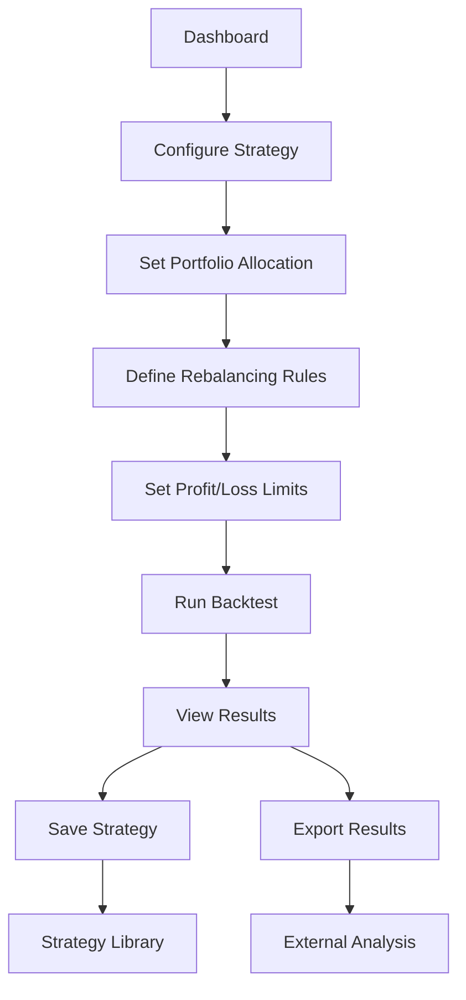

## 1. Product Overview
Strategy Optimizer is a financial analysis tool that back-tests LEAP options strategies combined with equity positions using historical market data. The app helps investors evaluate the performance of long-term option strategies with automated rebalancing and profit-taking mechanisms.

The product solves the problem of manually tracking complex options strategies and provides quantitative analysis for portfolio optimization decisions.

## 2. Core Features

### 2.1 User Roles
| Role | Registration Method | Core Permissions |
|------|---------------------|------------------|
| Standard User | Email registration | Create and run backtests, view results, save strategies |
| Premium User | Subscription upgrade | Unlimited backtests, advanced analytics, export results |

### 2.2 Feature Module
The Strategy Optimizer consists of the following main pages:
1. **Dashboard**: Strategy configuration, portfolio setup, parameter inputs
2. **Backtest Results**: Performance charts, trade history, risk metrics
3. **Strategy Library**: Saved strategies, comparison tools, export options

### 2.3 Page Details
| Page Name | Module Name | Feature description |
|-----------|-------------|---------------------|
| Dashboard | Strategy Configuration | Select target equity (QQQ/TSLA), set portfolio allocation (x% equity, y% LEAP calls, z% cash), configure LEAP parameters (12-18 month expiration, delta D) |
| Dashboard | Rebalancing Rules | Set rebalancing triggers: allocation deviation delta%, equity price movements (delta_down/delta_up), enable/disable automatic rebalancing |
| Dashboard | Profit/Loss Limits | Configure time-based profit taking: p_6/l_6 (>6 months), p_3/l_3 (3-6 months), p_0/l_0 (<3 months), set monthly withdrawal amount |
| Dashboard | Backtest Controls | Set initial portfolio size, select date range for historical data, run backtest with progress indicator |
| Backtest Results | Performance Overview | Display total return, annualized return, maximum drawdown, Sharpe ratio, equity curve chart with benchmark comparison |
| Backtest Results | Trade History | Show all LEAP purchases and sales with dates, prices, P&L, reasons for closing (profit target hit, expiration, rebalancing) |
| Backtest Results | Risk Analysis | Portfolio volatility, option Greeks exposure, allocation drift over time, rebalancing frequency analysis |
| Strategy Library | Saved Strategies | List all user-saved strategies with performance summary, duplicate/edit existing strategies, delete unwanted strategies |
| Strategy Library | Strategy Comparison | Side-by-side performance comparison of multiple strategies, export results to CSV/PDF format |

## 3. Core Process
User Flow for Strategy Backtesting:
1. User navigates to Dashboard and configures strategy parameters
2. User selects target equity and sets portfolio allocation percentages
3. User defines rebalancing rules and profit/loss limits
4. User specifies initial capital and monthly withdrawal amount
5. User runs backtest and views real-time progress
6. System displays results with comprehensive performance metrics
7. User can save strategy for future reference or export results

## 4. User Interface Design

### 4.1 Design Style
- **Primary Colors**: Financial blue (#1E3A8A) and green (#059669) for positive returns
- **Secondary Colors**: Neutral grays (#6B7280, #9CA3AF) for backgrounds and text
- **Button Style**: Rounded corners (8px radius), hover effects, clear call-to-action hierarchy
- **Typography**: Inter font family, 14px base size, clear hierarchy with font weights 400, 500, 600
- **Layout**: Card-based design with consistent spacing (8px grid system), sidebar navigation
- **Icons**: Feather icons for consistency, green/red indicators for profit/loss

### 4.2 Page Design Overview
| Page Name | Module Name | UI Elements |
|-----------|-------------|-------------|
| Dashboard | Strategy Configuration | Card layout with form inputs, equity selector dropdown, percentage sliders for allocation, numeric inputs for LEAP parameters |
| Dashboard | Rebalancing Rules | Toggle switches for rule activation, numeric input fields with percentage labels, visual indicators for active rules |
| Dashboard | Profit/Loss Limits | Table format with time windows, input fields for profit/loss limits, color-coded profit targets vs loss limits |
| Backtest Results | Performance Overview | Full-width card with line chart for equity curve, metric cards with large numbers, benchmark comparison overlay |
| Backtest Results | Trade History | Data table with sortable columns, color-coded P&L values, pagination for large datasets |
| Strategy Library | Saved Strategies | Grid layout with strategy cards, mini performance charts, action buttons (view, duplicate, delete) |

### 4.3 Responsiveness
Desktop-first design with responsive breakpoints at 768px and 1024px. Mobile optimization includes touch-friendly controls, collapsible navigation, and simplified charts for smaller screens.

### 4.4 Data Visualization
Charts use Chart.js with financial styling, including candlestick patterns for equity prices, line charts for portfolio value over time, and bar charts for trade frequency analysis.