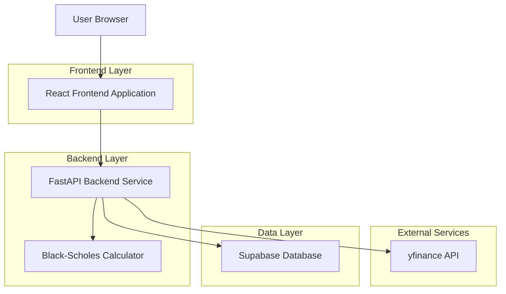
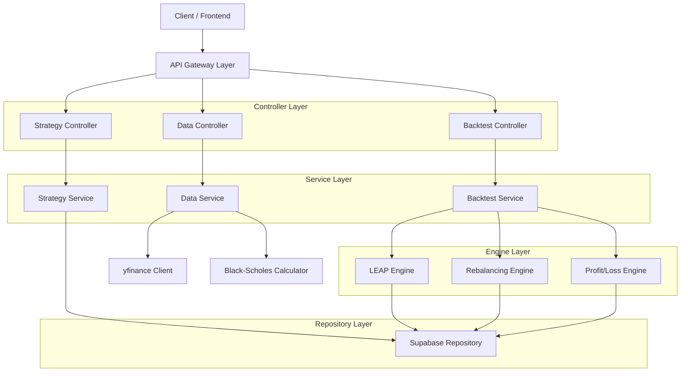
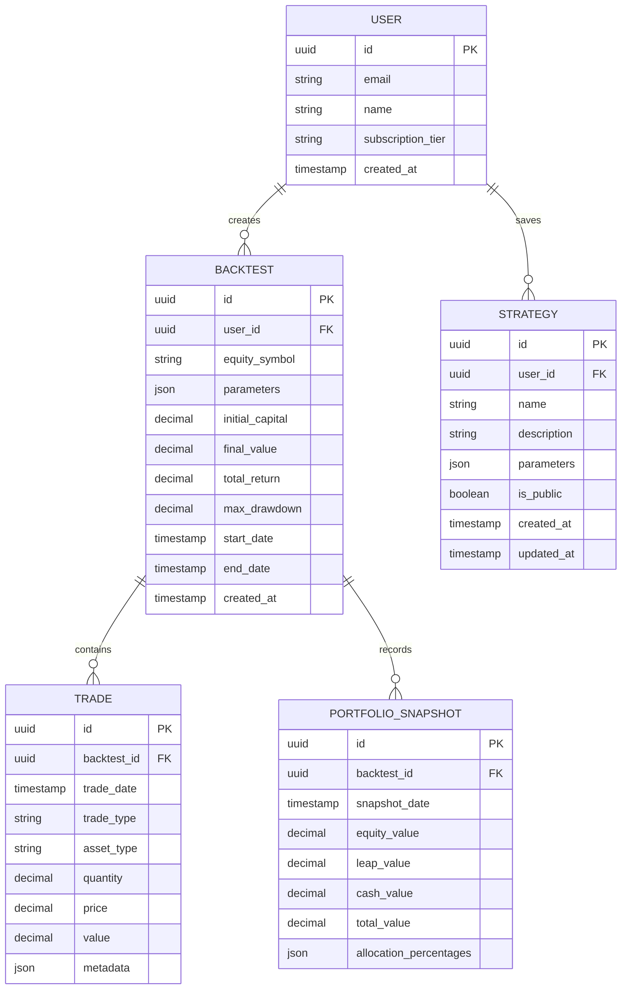

## 1. Architecture Design



## 2. Technology Description

* **Frontend**: React\@18 + Vite + TailwindCSS\@3 + Chart.js\@4

* **Initialization Tool**: vite-init

* **Backend**: FastAPI\@0.104 (Python)

* **Database**: Supabase (PostgreSQL)

* **Data Sources**: yfinance for equity data, Black-Scholes model for option pricing

* **Key Dependencies**: pandas, numpy, scipy, yfinance, supabase-py, fastapi-cors

## 3. Route Definitions

| Route                      | Purpose                                     |
| -------------------------- | ------------------------------------------- |
| /                          | Dashboard page with strategy configuration  |
| /backtest                  | Backtest results and performance analysis   |
| /strategies                | Strategy library and comparison tools       |
| /api/backtest/run          | Execute backtest with provided parameters   |
| /api/backtest/results/{id} | Retrieve backtest results by ID             |
| /api/strategies            | CRUD operations for saved strategies        |
| /api/equity/data           | Fetch historical equity data                |
| /api/options/pricing       | Calculate option prices using Black-Scholes |

## 4. API Definitions

### 4.1 Backtest Execution API

```
POST /api/backtest/run
```

Request:

| Param Name               | Param Type | isRequired | Description                                 |
| ------------------------ | ---------- | ---------- | ------------------------------------------- |
| equity\_symbol           | string     | true       | Target equity symbol (QQQ, TSLA)            |
| start\_date              | string     | true       | Backtest start date (YYYY-MM-DD)            |
| end\_date                | string     | true       | Backtest end date (YYYY-MM-DD)              |
| initial\_capital         | number     | true       | Initial portfolio value in USD              |
| equity\_allocation       | number     | true       | Percentage allocation to equity (0-100)     |
| leap\_allocation         | number     | true       | Percentage allocation to LEAP calls (0-100) |
| leap\_delta              | number     | true       | Target delta for LEAP options (0.5-0.8)     |
| leap\_expiration\_months | number     | true       | LEAP expiration timeframe (12-18)           |
| rebalance\_delta         | number     | false      | Allocation deviation trigger (%)            |
| equity\_down\_trigger    | number     | false      | Equity price drop trigger (%)               |
| equity\_up\_trigger      | number     | false      | Equity price rise trigger (%)               |
| profit\_limit\_6m        | number     | false      | Profit limit for >6 months to expiration    |
| loss\_limit\_6m          | number     | false      | Loss limit for >6 months to expiration      |
| profit\_limit\_3m        | number     | false      | Profit limit for 3-6 months to expiration   |
| loss\_limit\_3m          | number     | false      | Loss limit for 3-6 months to expiration     |
| profit\_limit\_0m        | number     | false      | Profit limit for <3 months to expiration    |
| loss\_limit\_0m          | number     | false      | Loss limit for <3 months to expiration      |
| monthly\_withdrawal      | number     | false      | Monthly cash withdrawal amount              |

Response:

| Param Name   | Param Type | Description                                   |
| ------------ | ---------- | --------------------------------------------- |
| backtest\_id | string     | Unique identifier for the backtest            |
| status       | string     | Execution status (running, completed, failed) |
| progress     | number     | Completion percentage (0-100)                 |
| results\_url | string     | Endpoint to retrieve full results             |

Example:

```json
{
  "equity_symbol": "QQQ",
  "start_date": "2020-01-01",
  "end_date": "2023-12-31",
  "initial_capital": 100000,
  "equity_allocation": 60,
  "leap_allocation": 30,
  "leap_delta": 0.7,
  "leap_expiration_months": 15,
  "rebalance_delta": 5,
  "equity_down_trigger": 10,
  "equity_up_trigger": 15,
  "profit_limit_6m": 50,
  "loss_limit_6m": 30,
  "monthly_withdrawal": 500
}
```

### 4.2 Strategy Management API

```
GET /api/strategies
```

Response:

| Param Name   | Param Type | Description                           |
| ------------ | ---------- | ------------------------------------- |
| strategies   | array      | List of saved strategy configurations |
| total\_count | number     | Total number of strategies            |

```
POST /api/strategies/save
```

Request:

| Param Name  | Param Type | isRequired | Description                        |
| ----------- | ---------- | ---------- | ---------------------------------- |
| name        | string     | true       | Strategy name                      |
| description | string     | false      | Strategy description               |
| parameters  | object     | true       | Complete strategy parameter object |

## 5. Server Architecture Diagram



## 6. Data Model

### 6.1 Data Model Definition



### 6.2 Data Definition Language

```sql
-- Users table
CREATE TABLE users (
    id UUID PRIMARY KEY DEFAULT gen_random_uuid(),
    email VARCHAR(255) UNIQUE NOT NULL,
    name VARCHAR(100) NOT NULL,
    subscription_tier VARCHAR(20) DEFAULT 'free' CHECK (subscription_tier IN ('free', 'premium')),
    created_at TIMESTAMP WITH TIME ZONE DEFAULT NOW()
);

-- Backtests table
CREATE TABLE backtests (
    id UUID PRIMARY KEY DEFAULT gen_random_uuid(),
    user_id UUID NOT NULL REFERENCES users(id) ON DELETE CASCADE,
    equity_symbol VARCHAR(10) NOT NULL,
    parameters JSONB NOT NULL,
    initial_capital DECIMAL(12,2) NOT NULL,
    final_value DECIMAL(12,2),
    total_return DECIMAL(8,4),
    max_drawdown DECIMAL(8,4),
    start_date DATE NOT NULL,
    end_date DATE NOT NULL,
    created_at TIMESTAMP WITH TIME ZONE DEFAULT NOW(),
    updated_at TIMESTAMP WITH TIME ZONE DEFAULT NOW()
);

-- Strategies table
CREATE TABLE strategies (
    id UUID PRIMARY KEY DEFAULT gen_random_uuid(),
    user_id UUID NOT NULL REFERENCES users(id) ON DELETE CASCADE,
    name VARCHAR(100) NOT NULL,
    description TEXT,
    parameters JSONB NOT NULL,
    is_public BOOLEAN DEFAULT false,
    created_at TIMESTAMP WITH TIME ZONE DEFAULT NOW(),
    updated_at TIMESTAMP WITH TIME ZONE DEFAULT NOW()
);

-- Trades table
CREATE TABLE trades (
    id UUID PRIMARY KEY DEFAULT gen_random_uuid(),
    backtest_id UUID NOT NULL REFERENCES backtests(id) ON DELETE CASCADE,
    trade_date DATE NOT NULL,
    trade_type VARCHAR(20) NOT NULL CHECK (trade_type IN ('BUY', 'SELL')),
    asset_type VARCHAR(20) NOT NULL CHECK (asset_type IN ('EQUITY', 'LEAP_CALL', 'CASH')),
    quantity DECIMAL(12,4) NOT NULL,
    price DECIMAL(12,4) NOT NULL,
    value DECIMAL(12,2) NOT NULL,
    metadata JSONB,
    created_at TIMESTAMP WITH TIME ZONE DEFAULT NOW()
);

-- Portfolio snapshots table
CREATE TABLE portfolio_snapshots (
    id UUID PRIMARY KEY DEFAULT gen_random_uuid(),
    backtest_id UUID NOT NULL REFERENCES backtests(id) ON DELETE CASCADE,
    snapshot_date DATE NOT NULL,
    equity_value DECIMAL(12,2) NOT NULL,
    leap_value DECIMAL(12,2) NOT NULL,
    cash_value DECIMAL(12,2) NOT NULL,
    total_value DECIMAL(12,2) NOT NULL,
    allocation_percentages JSONB NOT NULL,
    created_at TIMESTAMP WITH TIME ZONE DEFAULT NOW()
);

-- Create indexes for performance
CREATE INDEX idx_backtests_user_id ON backtests(user_id);
CREATE INDEX idx_backtests_created_at ON backtests(created_at DESC);
CREATE INDEX idx_strategies_user_id ON strategies(user_id);
CREATE INDEX idx_trades_backtest_id ON trades(backtest_id);
CREATE INDEX idx_trades_trade_date ON trades(trade_date);
CREATE INDEX idx_portfolio_snapshots_backtest_id ON portfolio_snapshots(backtest_id);
CREATE INDEX idx_portfolio_snapshots_snapshot_date ON portfolio_snapshots(snapshot_date);

-- Grant permissions
GRANT SELECT ON users TO anon;
GRANT ALL PRIVILEGES ON users TO authenticated;
GRANT SELECT ON backtests TO anon;
GRANT ALL PRIVILEGES ON backtests TO authenticated;
GRANT SELECT ON strategies TO anon;
GRANT ALL PRIVILEGES ON strategies TO authenticated;
GRANT SELECT ON trades TO anon;
GRANT ALL PRIVILEGES ON trades TO authenticated;
GRANT SELECT ON portfolio_snapshots TO anon;
GRANT ALL PRIVILEGES ON portfolio_snapshots TO authenticated;
```

