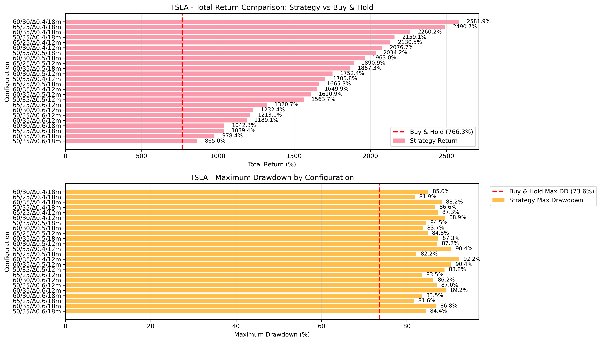
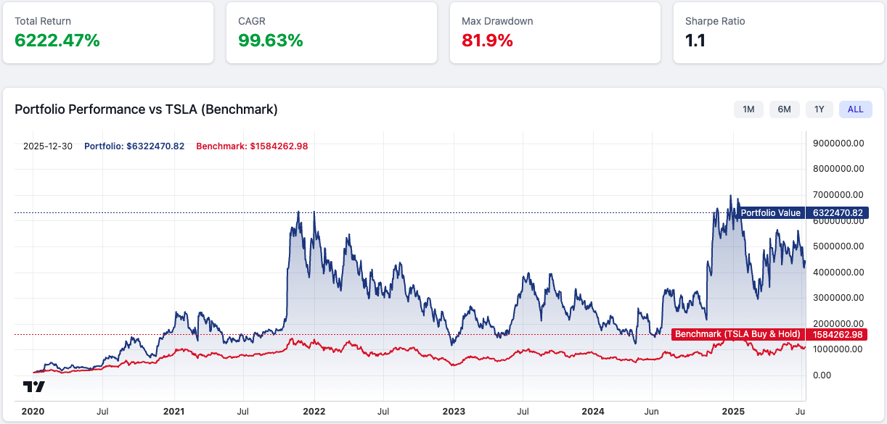

# A Strategy to Double Your Return with TSLA
## Strategy Overview

For investors with a high conviction in the long-term growth potential of TSLA or similar equities, and are comfortable with the the stock's higher volatility, you can consider this 65% Stock + 25% LEAP Option strategy. It can help you systematically outperform a standard buy-and-hold.

I back tested this strategy with TSLA from 2020-01-01 to 2025-01-01, and the results show that this strategy has Compounding Annual Growth Rate (CAGR) of 100%, far exceed the 57%  CAGR of just holding TSLA for the same period. In other words, if we were invest 10k in this strategy, we would end up with 6.3 million in 6 years time, compared to 1.5 million if we just held TSLA for the same period.

## Strategy In Details
Below is how the strategy is setup. I will use TSLA for example, but we can replace it with QQQ or any other stock.
1. Allocate $x\%$ of the portfolio with TSLA, $y\%$ to LEAP call of TSLA with 12 to 18 months expiration and with Delta `D`, The rest of the portfolio ($100\% - x\% - y\%$) is cash.
2. Rebalance the portfolio when the following events happen:
   - The any one of the three types of asset drifts from target percentage by $d\%$
   - When any LEAP calls hit the following target profit or loss limit

 | Time to Expiration | Profit limit | Loss Limit | 
 | ------------------ | ----------- | ------------ | 
 | >6 months          | $p_6$         | $l_6$          | 
 | 3 to 6 months      | $p_3$         | $l_9$          | 
 | < 3 months         | $p_0$         | $l_0$          | 

## Finding the Optimal Strategy
To find the optimal strategy, we need to find the best combination of the above parameters. Using the last 6 years of TSLA data, we can back test a few combinations of these parameters. 
Below are how the parameters are setup:

| Parameter | Value |
| -------- | ------- |
| Target Equities | TSLA, QQQ|
| Delta of LEAP Calls | 0.4, 0.5, 0.6 |
| Expiration | 12, 18 months |
| Rebalancing Triggers | Allocation Drift = 5% |
| Profit / Loss Limits (>6 Months to Expiry) | Take 100% profit, cut 60% loss |
| Profit / Loss Limits (3 to 6 Months to Expiry) | Take 30% profit, cut 20% loss |
| < 3 Months to Expiry | Take 10% profit, cut 10% loss |

Below are the results of the back test. Each bar represents a combination of parameter values, for example, "65/25 $\Delta$ 0.4 / 18m" means 65% of the portfolio is with TSLA, 25% with LEAP call Delta `D` = 0.4 and 18 months expiration when the LEAP call is open.

The first chart is the total return comparison of the strategies, while the second chart is the draw down comparison.

The results show that the optimal strategy is to allocate 65% of the portfolio with TSLA, 25% with LEAP call with 12 to 18 months expiration and with Delta `D` = 0.5.

## Performance of the Optimal Strategy
Let's look at how this optimal strategy looks like compared to the buy-and-hold strategy (benchmark):

 

### Who this Strategy is Suitable For

This strategy is particularly well-suited for long-term investors who are:
* **Long-term bullish on the stock** - Have strong conviction in the company's fundamentals and growth prospects
* **Can tolerate high volatility of the stock** - Understand that leveraged strategies amplify both gains and losses
* **Are willing to accept higher risk to generate additional returns** - Seek alpha generation beyond traditional buy-and-hold approaches
* **Have sufficient capital for options trading** - Meet minimum requirements for options approval and position sizing
* **Understand options mechanics** - Familiar with concepts like delta, time decay, and implied volatility

### Caveats and Risk Considerations

**Drawdown Risk**: The leveraged nature of LEAP options can amplify losses during market downturns. Maximum drawdowns may exceed those of the underlying stock.

**Time Decay**: While reduced compared to short-term options, LEAP options still experience time decay, particularly as expiration approaches.

**Volatility Risk**: Changes in implied volatility can significantly impact option values, even if the underlying stock price remains stable.

**Liquidity Risk**: LEAP options may have wider bid-ask spreads and lower trading volumes than the underlying stock.

**Assignment Risk**: Early assignment is possible for American-style options, though less likely for deep in-the-money LEAP calls.

**Rebalancing Costs**: Frequent rebalancing may incur transaction costs and tax implications.

